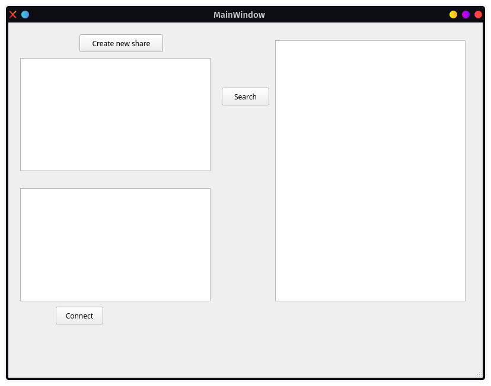
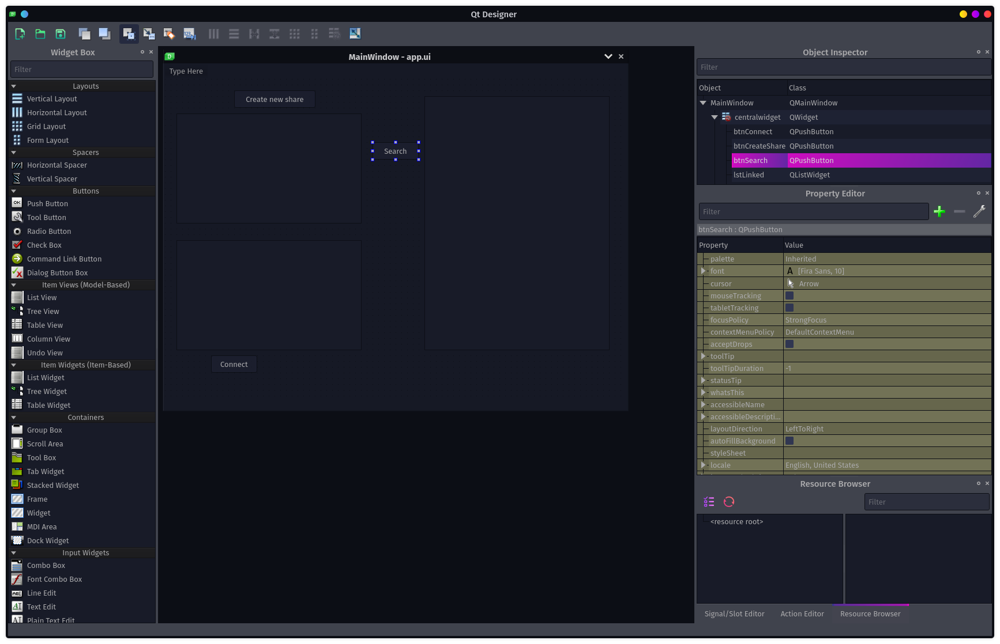
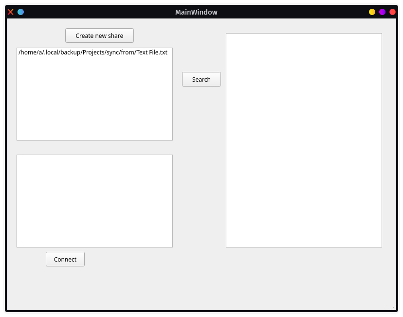
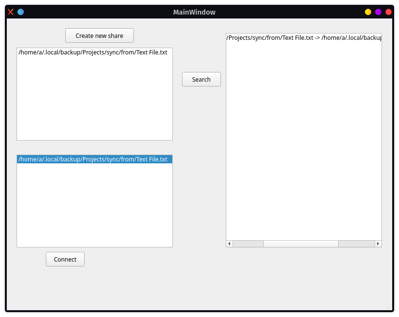
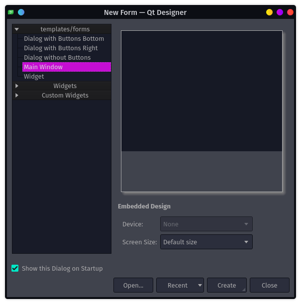
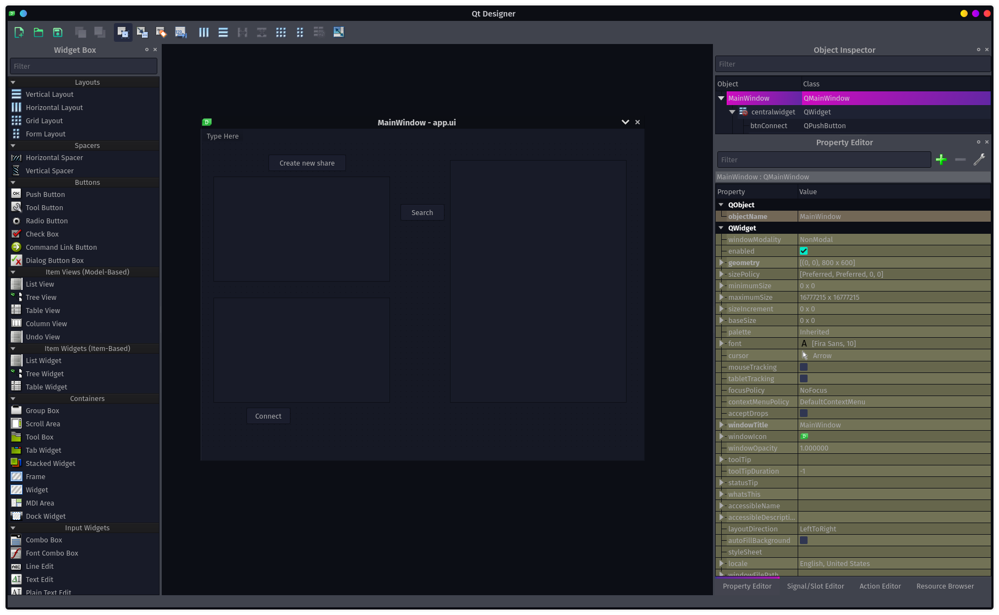

# Uvod
Za maturitetni izdelek sem si izbral izdelavo programa za varno sinhronizacijo datotek med računalniki, pri katerem si prosto izbiraš datoteke, ki bi jih rad z drugimi delil in tiste, ki bi jih rad od drugih skopiral. Prenos datoteke je tudi varen, da ne more kdorkoli videti, kakšne datoteke prenašaš.

Za ta izdelek sem se odločil, ker trenutne rešitve ne zadoščajo mojim potrebam varnosti. Trenutne rešitve delujejo preko oblaka, kamor pošlješ vse svoje datoteke. Ampak pri takšni rešitvi ne moreš zagotoviti, da ne bo nihče na oblaku prebral tvoje datoteke.



\newpage

# neovim
Večino kode sem napisal v urejevalniku besedil Neovim. Znan je za njegovo hitrost in učinkovitost. Je tudi t.i. modalen urejevalnik, kar pomeni, da ima več načinov delovanja. Vim ima dosti načinov kot so Normalen, v katerem izvajaš ukaze (kot so kopiranje, brisanje, premikanje...), Vnosni način delovanja, v katerem večinoma pišeš besedilo, in še dosti več drugih. Modalni urejevalniki besedil so dandanes zelo redki, kar se jih je težje naučiti kot navadne urejevalnike besedil.


\newpage

# C++
Program je v celoti napisan v programskem jeziku C++. C++ je splošno-namenski programski jezik, katerega je izdelal Bjarne Stroustrup kot nadgradnjo jezika C. Izdelan je bil z namenom pisanja sistemskih programov, programov na vgrajenih sistemih, programov z omejenim spominom, programov z hitrostno zahtevnimi potrebami... in je zato bil izdelan z hitrostjo in fleksibilnostjo v mislih. Uporablja se v raznovrstnih programih, kot so namizne aplikacije, igre, strežniki in dosti drugih. Standardiziran je z strani Mednarodne organizacije za standardizacijo ISO (international organization for standardization) z najnovejšo verzijo standarda ISO/IEC 14882:2020 (neformalno poznana kot C++20). Od leta 2012 je C++ na triletnem urniku izdaje z C++23, kot naslednji načrtovan standard.

{width=50%}

\newpage

# Meson
Za izdelavo programa sem uporabil tudi orodje Meson. Meson je orodje za avtomatiziranje kompilacije programov. Je odprtokoden in napisan v programskem jeziku Python. Izdan je pod Apache 2.0 Licenco. Podpira kompilacijo programov napisanih v različnih jezikih, kot so C, C++, D, Fortran, Java, C#, Rust in drugih. Podpira več prevajalnikov, kot so GNU Compiler Collection, Clang in druge in primarno v odzadju uporablja sistem Ninja. Za opis postopka kompilacije programov uporabiš sintakso Meson jezika.


\newpage

# Qt designer
Qt designer je orodje, katerega sem uporabil za oblikovanje in izdelavo uporabniškega vmesnika (GUI). V njem lahko izdelaš okna ali dialoge v t.i. what-you-see-is-what-you-get (WYSIWYG) načinu, in jih stestiraš v različnih stilih in resolucijah.

Forme izdelane v qt designer-u se integrira neopazno z napisano kodo, z uporabo qt-jevih mehanizmov slotov in signalov, da lahko enostavno nastaviš delovanje grafičnih elementov. Vse lastnosti izbrane v qt designer-u so lahko dinamično  spremenjene v kodi.



\newpage

# Knjižnice
Za izdelavo programa sem poleg C++ standardne knjižnice (stl) uporabil tri nestandardne knjižnice.

## Qt
Knjižnico Qt sem uporabil za izdelavo grafičnega vmesnika. Narejena je iz več delov, a jas sem uporabil le Qt Widgets. Ta knjižnica mi je omogočila uporabo forme, katero sem oblikoval in izdelal v Qt designer-u. V osnovi je Qt komplet orodij za izdelavo grafičnih aplikacij, katere delajo na različnih platformah, kot so Linux, Windows, macOS, Android brez sprememb v kodi.

Qt trenutno razvijata podjetje "The Qt Company" in organizacija "Qt Project". Na voljo je v večih različicah z komercijalnimi in odprtokodnimi licencami. Najnovejša verzija Qt-ja je Qt6, katera je bila izdana 8. decembra 2020.


\newpage

## libssh
Varno komunikacijo mi je omogočila knjižnica libssh. Libssh je odprtokodna knjižnica za C jezik, ki izvaja SSHv2 protokol za strani odjemalca in strežnika. Z njo lahko na daljavo izvajaš programe, prenašaš datoteke, urejaš z javnimi ključi in dosti več. Podpira različne platforme, kot so Linux, Unix, BSD, Solaris, OS/2 in Windows. Na voljo je tudi v drugih programskih jezikih, kot so Python, Perl, Rust in drugi.


\newpage

## Boost
Boost knjižnico sem v glavnem uporabil za izdelavo json paketov. Boost prispeva recenzirane prenosne C++ izvorne knjižnice. Boost knjižnice dobro delujejo z C++ standardom in so predvidevano uporabne na širokem spektru aplikacij. C++ komite standardov je že več knjižnic iz Boost-a dodal v C++ standardno knjižnico (stl). Najnovejša verzija knjižnice boost je 1.79.0, ki je bila izdana 13. aprila 2022.


\newpage

# Izdelava programa

## Delovanje
Preden se podamo v kodo, opišem kako program deluje. Ko uporabnik stisne gumb "Search", program pošlje v omrežje paket z vsemi datotekami, ki jih ima v skupni rabi. Vsi računalniki, ki ta paket dobijo, pošljejo nazaj svoj enak paket. Če uporabnik želi dati datoteko v skupno rabo, mora stisniti gumb "Create new share", kateri ga vpraša za datoteko, ki jo želi dati v skupno rabo. Ko si želi datoteko sinhronizirati na svoj računalnik, mora stisniti na eno datoteko v seznamu z tujimi datotekami (seznam spodaj levo) in stisniti gumb "Connect". Nato ga vpraša za mapo v katero želi datoteko shraniti in jo v to mapo sinhronizira. Vse datoteke, ki jih ima sinhronizirane na svoj računalnik, se mu pokažejo na seznamu na desni strani.


{width=80%}

{width=80%}

{width=80%}

\newpage

## Grafični vmesnik
Izdelava grafičnega vmesnika ni težka, saj sem uporabil orodje Qt designer, ki mi je delo zelo olajšalo. Najprej sem naredil novo okno z predlogo "Main Window". Glej sliko.

{width=80%}


V Widget Box-u imaš več t.i. widget-ov, ki jih lahko uporabljaš. Jas sem uporabil le gumb (Push Button) in seznam (List Widget). Imajo več lastnosti (glej sliko), a trenutno so edine pomembne objectName in gumbov text

* objectName: Ta lastnost pove, kakšno ime bo ta widget imel v kodi.

* text: Ta lastnost na gumbu pove, kakšno besedilo se bo prikazalo na gumbu.


Moj program ima le 3 gumbe in 3 sezname. Končen izgled je prikazan na sliki.




\newpage

## Grafični vmesnik v kodi

V kodi ta grafični vmesnik dostopaš tako, da narediš nov razred, katerega razširiš z tem oknom

```cpp
// okno, ki smo ga naredili je Ui::MainWindow
class MainWindow : public QMainWindow, private Ui::MainWindow {
	// vsi razredi v knjižnici qt morajo imeti Q_OBJECT na začetku
	Q_OBJECT

public:
	MainWindow(Store &store);

// slot je funkcija, na katero lahko connectaš
private slots:
	void btn_search_click();
	void btn_connect_click();
	void btn_create_share_click();
};
```

V tem oknu nato povežeš gumbe z funkcijami z funkcijo connect
```cpp
MainWindow::MainWindow(Store &store) : store(store) {
	setupUi(this);


	// povežeš event clicked na funkcijo btn_search_click
	connect(btnSearch, &QPushButton::clicked, this,
					&MainWindow::btn_search_click);
	connect(btnConnect, &QPushButton::clicked, this,
					&MainWindow::btn_connect_click);
	connect(btnCreateShare, &QPushButton::clicked, this,
					&MainWindow:btn_create_share_click);
}
```

\newpage

## Broadcast podsistem
Da program pošlje paket vsem računalnikom v omrežju uporabi broadcast naslov. Za to uporabim knjižnico Boost.

V osnovi broadcast paket z knjižnico boost pošlješ tako, da najprej izdelaš kontekst izvajanja.
```cpp
boost::asio::io_context io;
```
izdelaš socket, kateremu določiš verzijo in port
```cpp
boost::asio::io_context io;
udp::socket socket(io, ip::udp::endpoint(ip::udp::v4(), 8888));
```
izdelaš objekt prejemnika in mu poveš, kam hočeš poslat svoj paket. V našem primeru hočemo poslati vsem računalnikom in zato določimo prejemnika kot broadcast.
```cpp
ip::udp::endpoint broadcast_endpoint(ip::address_v4::broadcast(), 8888);
```
pošlješ željen paket prejemniku
```cpp
socket.send_to(boost::asio::buffer("paket"), broadcast_endpoint);
```
če samo to narediš, ne bo nikoli poslalo. to bo le kontekstu reklo, da hočeš poslati. Če želiš, da kontekst to prošnjo izpolni, mu moraš reči naj izvede.
```cpp
io.run();
```

na koncu naša koda zgleda tako:

```cpp
namespace ip = boost::asio::ip;
boost::asio::io_context io;
udp::socket socket(io, ip::udp::endpoint(ip::udp::v4(), 8888));
ip::udp::endpoint broadcast_endpoint(ip::address_v4::broadcast(), 8888);
socket.set_option(boost::asio::socket_base::broadcast(true));
socket.send_to(boost::asio::buffer("paket"), broadcast_endpoint);
io.run();
```

## SFTP Server
Ta sistem naredi sftp strežnik in posluša za povezave. Ko se nek odjemalec poveže, dobi katero datoteko hoče in mu to datoteko pošlje. Ta sistem deluje s pomočjo knjižnice sshlib.

Najprej naredi novo sejo, nato proba avtenticirati. To naredi tako:
```cpp
bool authenticate(ssh_session session) {
	ssh_message message;
	bool authenticated = false;

	// dokler se ne avtenticira, proba dobivati sporočila
	while (!authenticated) {
		// počakaj, da dobi nekakšno sporočilo
		if (!(message = ssh_message_get(session))) {
			return false;
		}

		// če sporočilo ni pročnja za avtentifikacijo, ignoriraj sporočilo
		if (ssh_message_type(message) != SSH_REQUEST_AUTH) {
			ssh_message_reply_default(message);
			ssh_message_free(message);
			continue;
		}

		// avtentikacija s tem strežnikom je možna le z geslom. če ni prava
		// vrsta avtentikacije, mu to sporoči
		if (ssh_message_subtype(message) != SSH_AUTH_METHOD_PASSWORD) {
			ssh_message_auth_set_methods(message, SSH_AUTH_METHOD_PASSWORD);
			ssh_message_reply_default(message);
			ssh_message_free(message);
			continue;
		}

		// tukaj bi mogel preveriti, da se geslo ujema z datoteko v skupni
		// rabi, a trenutno še ne podpiramo datotek z gesli zato je to
		// komentirano

		/* std::string username = ssh_message_auth_user(message); */
		/* std::string password = ssh_message_auth_password(message); */
		/* if (username == password) { */
		/* 	ssh_message_auth_reply_success(message, 0); */
		/* } else { */
		/* 	ssh_message_reply_default(message); */
		/* } */


		// povej odjemalcu, da se je povezal in avtenticiral
		ssh_message_auth_reply_success(message, 0);

		ssh_message_free(message);
		authenticated = true;
	}
	return authenticated;
}
```

## SFTP Client
na strani odjemalca je to malo lažje.
```cpp
SFTP_Client_connect(const std::string &address, const unsigned int port,
                    const std::string &username,
                    const std::string &password) {
	// naredi novo sejo
	session = ssh_new();
	if (!session) {
		throw std::runtime_error("ssh_new");
	}

	// seji določi strežnik in port
	ssh_options_set(session, SSH_OPTIONS_HOST, address.c_str());
	ssh_options_set(session, SSH_OPTIONS_PORT, &port);

	// preveri, da se je seja uspešno povezala
	if (ssh_connect(session) != SSH_OK) {
		throw std::runtime_error("ssh_connect: " +
		                         std::string(ssh_get_error(session)));
	}

	// preveri certifikat strežnika (da je veljaven)
	// varnost na prvem mestu
	if (!authenticate_server(session)) {
		throw std::runtime_error("failed to authenticate server");
	}

	// probaj se avtenticirati (funkcija je zelo podobna
	// avtentikaciji na strežniku)
	if (ssh_userauth_password(session, username.c_str(), password.c_str()) !=
	    SSH_AUTH_SUCCESS) {
		throw std::runtime_error("failed to authenticate user");
	}

	// določi podsistem
	if (!(sftp = sftp_new(session))) {
		throw std::runtime_error("sftp_new error: " +
		                         std::string(ssh_get_error(session)));
	}

	if (sftp_init(sftp) != SSH_OK) {
		throw std::runtime_error("sftp_init error");
	}
}
```

\newpage

# Zaključek
Čeprav program ne zgleda kompleksen, saj ima le par gumbov in seznamov, ima program veliko nalog. Mora poslušati za povezave, shranjevati vse datoteke, ki jih ima v skupni rabi in vse datoteke, ki jih imajo povezane naprave v skupni rabi. Poleg tega mora prenašati datoteke in vse to asinhrono, da ne prekine uporabnika pri delu (predstavljajte si program, ki bi se vstavil vsakič ko neko datoteko pošilja ali prejema). Poleg tega pa mora poskrbeti za varen prenos teh datotek, da tudi če kdo prisluškuje, nič ne dobi. Grafični vmesnik, četudi je funkcionalen ni najlepši in bi lahko bil dosti boljši. Program očitno ni namenjen uporabi in je bolj prikaz koncepta varne sinhronizacije datotek, kar pa deluje.

## Dodatki
Nekaj idej, ki bi jih lahko dodali k programu:

* Gesla datotek: nočeš, da vsak, ki ima dostop do omrežja, lahko dostopa do vseh tvojih datotek. Lahko bi dodali geslo datoteki, katero morajo vnesti, ko se povezujejo.

* Sinhronizacija map: Kaj če hočem več datotek dati v skupno rabo. Moram vsako posebej dati? boljše bi bilo, da bi lahko vse datoteke dal v mapo in vse skupaj dal v skupno rabo.

* Sinhronizacija izven lokalnega omrežja: kaj če hočeš datoteko, a te ni v omrežju? Lahko bi dodali možnost vnosa ip-ja, do katerega se poveže.

In še dosti več. Dodatkov, ki bi jih lahko dodali, je ogromno. Naštel sem jih le nekaj najboljših.
